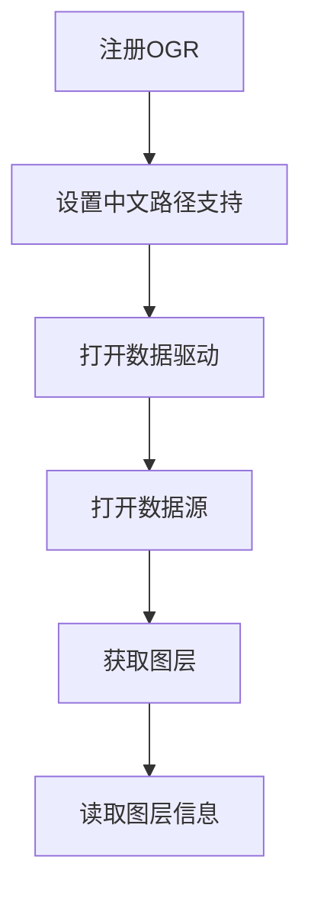
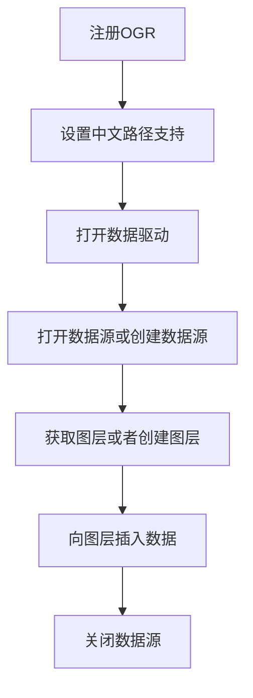
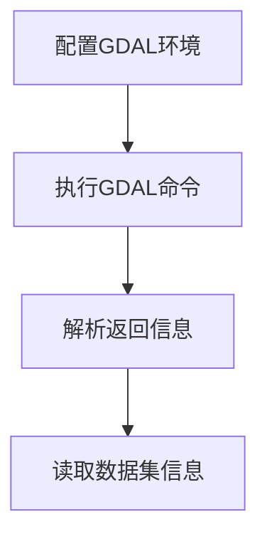

# FileGDB代码示例

## 1. 读取FileGDB图层

### 1.1 实现思路



### 1.2 代码示例

```Java

public Layer readGdbLayer(String driverName,String gdbPath,String layerName) {
        ogr.RegisterAll();
        gdal.SetConfigOption("GDAL_FILENAME_IS_UTF8", "YES");

        Driver driver = ogr.GetDriverByName(driverName);
        DataSource dataSource = driver.Open(gdbPath, 1);
        Layer layer = dataSource.GetLayerByName(layerName);

        for (int i = 0; i < layer.GetLayerDefn().GetFieldCount(); i++) {
            System.out.println(layer.GetLayerDefn().GetFieldDefn(i).GetName());
        }

        Feature feature = layer.GetNextFeature();
        while (feature != null) {
            for (int i = 0; i < feature.GetFieldCount(); i++) {
                System.out.println(feature.GetFieldDefnRef(i).GetName());
                System.out.println(feature.GetFieldAsString(i));
            }

            System.out.println(feature.GetGeometryRef().ExportToWkt());

            feature = layer.GetNextFeature();
        }

        return layer;
    }

```

## 2. 写入FileGDB图层

### 2.1 实现思路



### 2.2 代码示例

```Java

public void writeGdbLayer(String driverName,String gdbPath,String featureDataset,String layerName,int wkid,String wkt) {
        ogr.RegisterAll();
        gdal.SetConfigOption("GDAL_FILENAME_IS_UTF8", "YES");

        Vector options = null;
        if (CharSequenceUtil.isNotBlank(featureDataset)) {
            options = new Vector();
            options.add("FEATURE_DATASET=" + featureDataset);
        }

        Driver driver = ogr.GetDriverByName(driverName);
        DataSource dataSource = driver.Open(gdbPath, 1);
        if (dataSource == null) {
            dataSource = driver.CreateDataSource(gdbPath);
        }

        Layer layer = dataSource.GetLayerByName(layerName);
        if (layer == null) {
            SpatialReference sr = new SpatialReference();
            sr.ImportFromEPSG(wkid);
            layer = dataSource.CreateLayer(layerName, sr,6, options);
        }

        FieldDefn fieldDefn = new FieldDefn("TEST", 4);
        layer.CreateField(fieldDefn);

        Feature feature = new Feature(layer.GetLayerDefn());
        feature.SetGeometry(ogr.CreateGeometryFromWkt(wkt));
        feature.SetField("TEST", "test");
        layer.CreateFeature(feature);
        
        dataSource.delete();
    }

```

## 3. 读取FileGDB数据集

### 3.1 实现思路



### 3.2 代码示例

```Java

public void readGdbDs(String gisPath){
        SystemPropsUtil.set("GDAL_FILENAME_IS_UTF8", "YES");
        SystemPropsUtil.set("SHAPE_ENCODING", "UTF-8");
        String output = RuntimeUtil.execForStr(StandardCharsets.UTF_8, "ogrinfo", "-json", gisPath);
        
        String jout = null;
        if (!JSONUtil.isTypeJSONObject(output)) {
            jout = output.substring(output.indexOf("{"));
        }

        if (!JSONUtil.isTypeJSONObject(jout)) {
            jout = output.substring(output.indexOf("{"), output.lastIndexOf("}") + 1);
        }

        JSONObject jsonObject = JSON.parseObject(jout);
        String rootGroup = jsonObject.getString("rootGroup");
        System.out.println(rootGroup);
    }

```
