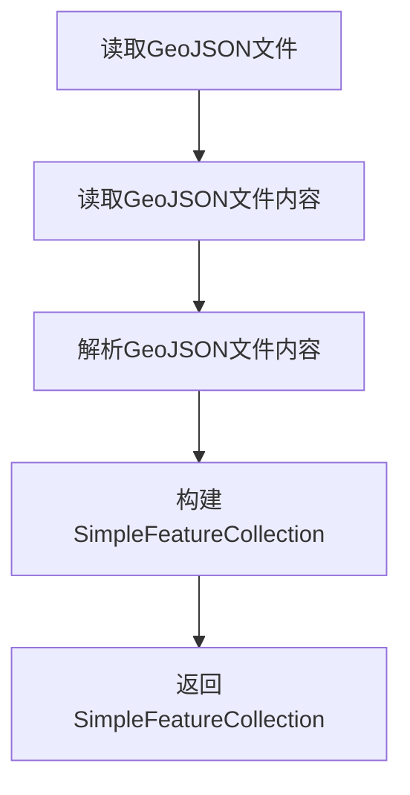
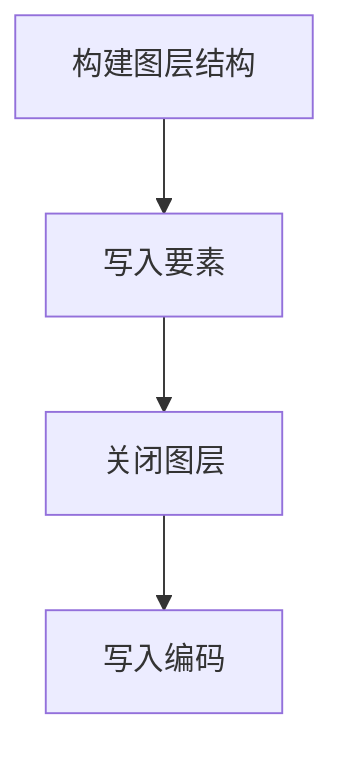

# GeoJSON代码示例

## 1. 读取GeoJSON文件

### 1.1 实现思路



### 1.2 代码示例

```Java

    public static SimpleFeatureCollection readGeojson(String geojsonPath){
        File file = new File(geojsonPath);
        Charset encoding = CharsetDetector.detect(file);
        String geojsonString = FileUtil.readString(file, encoding);

        GeometryJSON gjson = new GeometryJSON(16);
        FeatureJSON fjson = new FeatureJSON(gjson);

        try {
            SimpleFeatureType simpleFeatureType = fjson.readFeatureCollectionSchema(geojsonString, true);
            ListFeatureCollection featureCollection = new ListFeatureCollection(simpleFeatureType);
            try (FeatureIterator<SimpleFeature> features = fjson.streamFeatureCollection(geojsonString)) {
                while (features.hasNext()) {
                    featureCollection.add(features.next());
                }
            }

            return featureCollection;
        } catch (IOException e) {
            throw new RuntimeException(e);
        }
    }

```

## 2. 写入GeoJSON文件

### 2.1 实现思路



### 2.2 代码示例

```Java

    public static void writeGeojson(String geojsonPath, SimpleFeatureCollection featureCollection,Integer wkid){
        GeometryJSON gjson = new GeometryJSON(16);
        FeatureJSON fjson = new FeatureJSON(gjson);
        
        try {
            CoordinateReferenceSystem crs = CRS.decode("EPSG:" + wkid, true);
            featureCollection = new ForceCoordinateSystemFeatureResults(featureCollection, crs, false);

            String geojsonString = fjson.toString(featureCollection);
            FileUtil.writeString(geojsonString, geojsonPath, "utf-8");
        } catch (Exception e) {
            throw new RuntimeException(e);
        }
    }

```
