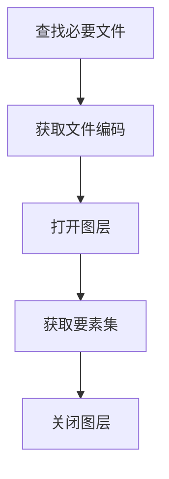
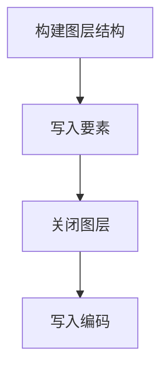

# Shapefile代码示例

## 1. 读取Shapefile文件

### 1.1 实现思路



### 1.2 代码示例

```Java

    public static SimpleFeatureCollection readShp(String shpPath) {
        List<String> bys = CollUtil.newArrayList(".shp",".shx",".dbf",".prj");
        for (String by : bys) {
            String path = CharSequenceUtil.replaceLast(shpPath, ".shp", by,true);
            if(!FileUtil.exist(path)){
                throw new RuntimeException(by+"类型的文件不存在");
            }
        }

        Charset shpCharset = null;
        String cpgPath = CharSequenceUtil.replaceLast(shpPath, ".shp", ".cpg",true);
        if(FileUtil.exist(cpgPath)){
            File cpgFile = FileUtil.file(cpgPath);
            Charset cpgCharset = CharsetDetector.detect(cpgFile);
            String cpgString = FileUtil.readString(cpgFile, cpgCharset);
            try {
                shpCharset = Charset.forName(cpgString.trim());
            } catch (Exception e) {
                throw new RuntimeException("CPG文件保存的编码格式错误");
            }
        }
        
        if (shpCharset == null) {
            String dbfPath = CharSequenceUtil.replaceLast(shpPath, ".shp", ".dbf",true);
            if(FileUtil.exist(dbfPath)){
                byte[] bs = FileUtil.readBytes(dbfPath);
                if (bs != null && bs.length >= 30) {
                    byte b = bs[29];
                    if (b == 0x4d) {
                        shpCharset = Charset.forName("GBK");
                    }
                }
            }
        }

        if(shpCharset == null){
            shpCharset = StandardCharsets.UTF_8;
        }
        
        try {
            File file = new File(shpPath);
            ShapefileDataStore shpDataStore = new ShapefileDataStore(file.toURI().toURL());
            shpDataStore.setCharset(shpCharset);
            String typeName = shpDataStore.getTypeNames()[0];
            SimpleFeatureSource source = shpDataStore.getFeatureSource(typeName);
            shpDataStore.dispose();
            return source.getFeatures();
        } catch (IOException e) {
            throw new RuntimeException(e);
        }
    }

```

[Shapefile文件编码参考文档](http://kikitamap.com/2015/12/21/TroubleshootingShapefile/)

## 2. 写入Shapefile文件

### 2.1 实现思路



### 2.2 代码示例

```Java

    public static void writeShp(String shpPath, SimpleFeatureCollection featureCollection){
        try {
            File shapeFile = new File(shpPath);
            Map<String, Serializable> params = new HashMap<>();
            params.put(ShapefileDataStoreFactory.URLP.key, shapeFile.toURI().toURL());

            ShapefileDataStore ds = (ShapefileDataStore) new ShapefileDataStoreFactory().createNewDataStore(params);
            SimpleFeatureType featureType = featureCollection.getSchema();
            ds.createSchema(featureType);
            Charset charset = StandardCharsets.UTF_8;
            ds.setCharset(charset);

            String typeName = ds.getTypeNames()[0];
            FeatureWriter<SimpleFeatureType, SimpleFeature> writer = ds.getFeatureWriterAppend(typeName, Transaction.AUTO_COMMIT);

            try (FeatureIterator<SimpleFeature> features = featureCollection.features()) {
                while (features.hasNext()) {
                    SimpleFeature feature = features.next();
                    writer.hasNext();
                    SimpleFeature writefeature = writer.next();
                    writefeature.setDefaultGeometry(feature.getDefaultGeometry());

                    for (PropertyDescriptor d : featureType.getDescriptors()) {
                        if (!(feature.getAttribute(d.getName()) instanceof Geometry)) {
                            Name name = d.getName();
                            Object value = feature.getAttribute(name);
                            writefeature.setAttribute(name, value);
                        }
                    }

                    writer.write();
                }
            }

            writer.close();
            ds.dispose();

            String cpgPath = shpPath.substring(0, shpPath.lastIndexOf(".")) + ".cpg";
            FileUtil.writeString("UTF-8", cpgPath, StandardCharsets.UTF_8);
        }catch (Exception e){
            throw new RuntimeException(e);
        }
    }

```

## 3. Shapefile代码操作的原则

- 默认使用UTF-8编码格式，根据实际情况处理编码问题
