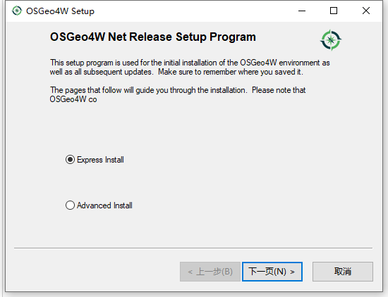
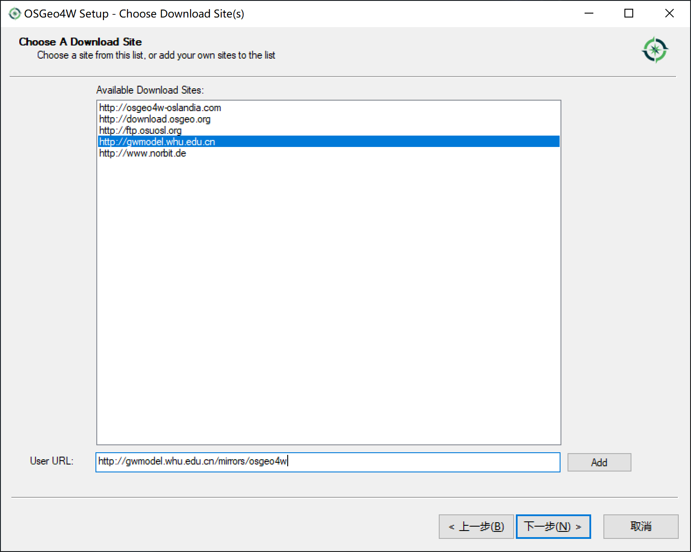
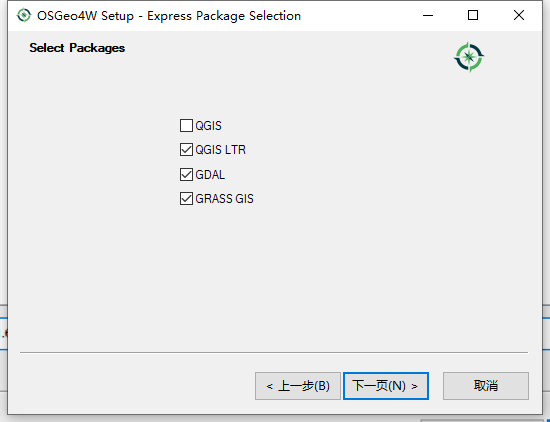

# Windows下的GDAL环境配置

在Windows下GDAL环境的配置方式有很多种，我尝试了很多不同的配置方式，包括Anaconda、
[GISInternals](https://www.gisinternals.com/index.html)、QGIS、OSGeo4W等，
我这里只说最简单的一种配置方式，基于OSGeo4W的配置方式。

## 安装

从[OSGeo4W官网](https://trac.osgeo.org/osgeo4w/)下载最新的osgeo4w-setup.exe安装包。按照下图步骤安装：

输入国内源
http://gwmodel.whu.edu.cn/mirrors/osgeo4w
默认的源是国外的，下载比较慢。

选择图上三个选项，然后下一步开始安装。

之所以要选择QGIS，是因为QGIS自带了Python环境，GDAL的一些命令是依赖于Python，如果没有Python环境，GDAL很多命令用不了，
而单独安装Python环境再配置GDAL的Python环境较麻烦，所以直接用QGIS自带的Python环境，
而且QGIS对常用的GDAL命令做了一些封装优化，用起来更简便。GRASS是安装QGIS就会默认安装的项，
选不选都会安装。QGIS和QGIS LTR的区别是，第一个是最新版本，第二个是最新的长期支持版本，
推荐使用QGIS LTR版本，更稳定，BUG更少，生产环境的话，必须使用QGIS LTR版本。

## GDAL环境变量配置

OSGEO4W_ROOT: C:\OSGeo4W

GDAL_DATA: %OSGEO4W_ROOT%\apps\gdal\share\gdal

GDAL_DRIVER_PATH: %OSGEO4W_ROOT%\apps\gdal\lib\gdalplugins

PROJ_LIB: %OSGEO4W_ROOT%\share\proj

PYTHONHOME: %OSGEO4W_ROOT%\apps\Python312

在PATH系统变量中追加如下值：

%OSGEO4W_ROOT%\bin

%PYTHONHOME%

%PYTHONHOME%\Scripts

到此GDAL环境基本配置完成。
